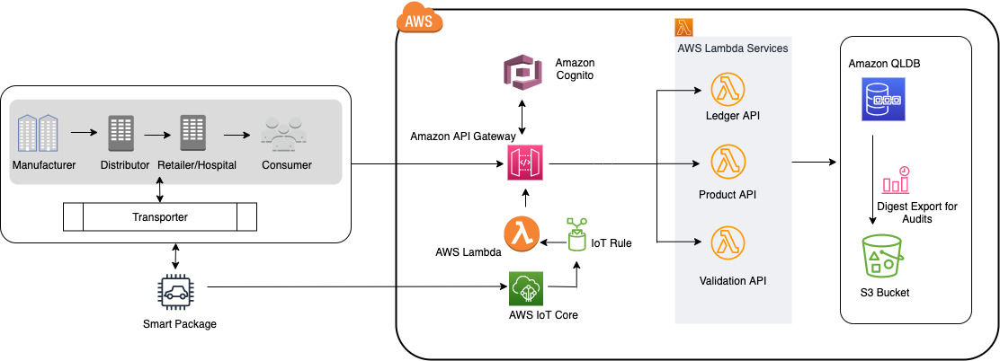

# Build an end-to-end application to track goods in a supply chain using Amazon QLDB

Today, companies build complex and custom mechanisms to achieve traceability inside supply chain systems. Instead of building custom ledger functionality on a traditional database system, you can take advantage of Amazon Quantum Ledger Database (Amazon QLDB) to record the history of each transaction in an immutable way on an Amazon QLDB journal. Amazon QLDB helps eliminate the need to engage in the complex development effort of building your ledger-like functionality in applications. With QLDB, the history of changes to your data is immutable—it can't be altered, updated, or deleted. 

In this post, we propose a solution to address a key challenge in the pharmaceutical supply chain around tracking and validating the authenticity of manufactured drugs that require strict cold chain storage during the entire supply chain. You can adopt these concepts to implement product traceability into other kinds of sophisticated supply chains as well.

The following figure depicts the reference architecture of solution. 



## Prerequisites and Setup

The quick deployment of the solution is using [AWS Cloud Development Kit (AWS CDK)](https://docs.aws.amazon.com/cdk/v2/guide/home.html) to create the resources required for this post, such as [Amazon API Gateway](https://aws.amazon.com/api-gateway/) endpoint, [AWS Lambda](https://aws.amazon.com/lambda/) functions, [Amazon Quantum Ledger Database(Amazon QLDB)](https://aws.amazon.com/qldb/), [AWS Identity and Access Management (IAM)](http://aws.amazon.com/iam) role, related permission policies and optional components - [Amazon Cognito](https://aws.amazon.com/cognito/) user pool, and [AWS IoT](https://aws.amazon.com/iot/) thing with associated rule and permissions. 

You can use [AWS Cloud9](https://docs.aws.amazon.com/cloud9/latest/user-guide/setup-express.html), a cloud-based integrated development environment, to complete the actions or run the setup locally on a Windows or Mac workstation/laptop. If you are running the set up locally then install and configure following toolset – 

•	[AWS CLI](https://docs.aws.amazon.com/cli/latest/userguide/getting-started-install.html)
•	[Node.js](https://nodejs.org/en/download)
•	[Python](https://www.python.org/downloads/release/python-3716/)
•	[TypeScript](https://www.npmjs.com/package/typescript)
•	[AWS CDK for TypeScript](https://docs.aws.amazon.com/cdk/v2/guide/getting_started.html) 
•	[Postman](https://www.postman.com/) or [Curl](https://curl.se/)

We are using AWS Cloud9 to set up and run the project, which comes pre-installed with all the above tooling. Follow below steps for solution setup - 

1)	Clone the code from GitHub repo on Cloud 9 terminal shell
```
git clone https://github.com/abhisheksarolia/track-n-trace-usng-qldb.git

cd track-n-trace-usng-qldb/
```

2)	The AWS CDK includes a library of AWS constructs called the AWS Construct Library, organized into various modules. The library contains constructs for each AWS service. Install the main CDK package for TypeScript – 
```
npm install aws-cdk-lib  
```
3)	Create new directory & install required dependency modules from the “requirements.txt” using python package manager-
```
mkdir sharedLib
mkdir sharedLib/python

pip install -r requirements.txt -t ./sharedLib/python  
```
4)	Create an IAM role with administrator access and [attach the role on cloud9 instance](https://aws.amazon.com/blogs/security/easily-replace-or-attach-an-iam-role-to-an-existing-ec2-instance-by-using-the-ec2-console/). You can use this [deep link to create the role with administrator access](https://console.aws.amazon.com/iam/home#/roles$new?step=review&commonUseCase=EC2%2BEC2&selectedUseCase=EC2&policies=arn:aws:iam::aws:policy%2FAdministratorAccess).


5)	Validate the CDK version on your Cloud9 instance – 
```
cdk –-version
```
If the output of above command comes as “2.80.0”, then upgrade the CDK to “2.81.0”
```
npm install -g aws-cdk@2.81.0 --force 
```
Validate the version again to make sure CDK version is upgraded.
```
cdk –-version 
```
6)	Synthesize the CDK template. 
```
cdk synth
```

The first time you deploy an AWS CDK app into an environment (account/region), you install a “bootstrap stack”. This stack includes resources that are used in the toolkit’s operation. For example, the stack includes an S3 bucket that is used to store templates and assets during the deployment process. 

7)	You can use “cdk bootstrap” command to install the bootstrap stack into an environment – 
```
cdk bootstrap
``` 

8)	Deploy the stack – 
```
cdk deploy
```

> Once the stack deployment completes, verify created resources in the AWS console under CloudFormation stacks with the name “TrackntraceCdkStack”


> For invoking API in this post, we will use Postman but you can invoke API via curl also. Go ahead and install Postman locally from [here](https://www.postman.com/downloads/?utm_source=postman-home).


Clean Up:

1. Destroy the resources - 
```
cdk destroy 
```

2. Edit QLDB delete protection from AWS Console and delete that on UI or run below aws CLI command 

```
aws qldb delete-ledger --name trackntrace-using-qldb

```


